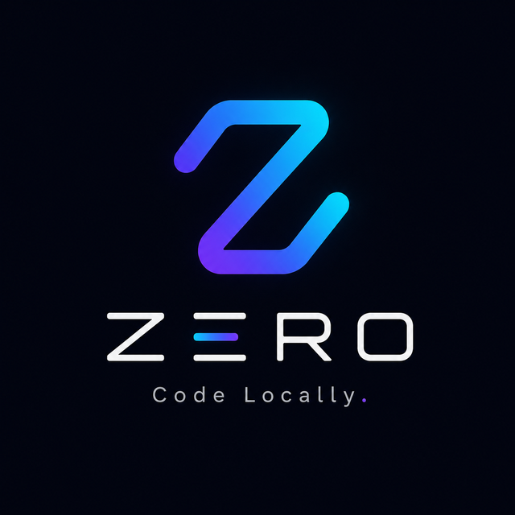

# Zero

<p align="center">
  
</p>

Zero is a local-first coding environment. The primary use case is coding fully
offline: you write code by hand with copilot-style inline completions from an
on-device model, plus an integrated terminal and a chat panel for asking
about the codebase. Online capabilities come later and are strictly additive.

Zero is a platform with one core engine and multiple flavours built on it:

- **Zero (v1)** - browser UI plus a local daemon: editor, completions,
  terminal, LSP, Graphify context, chat.
- **Zero Agents** - headless autonomous agent runs over the same engine.
- **Zero Lite** - pure-browser, zero-install flavour; no daemon, browser APIs
  only.
- **Zero Claude Plugin** - exposes Gemini Nano on Chrome as a model that
  Claude Code can be pointed at, enabling a fully offline Claude Code.
- **Zero IDE** - desktop app wrapping the same client and daemon.

Full design and roadmap:
[`docs/superpowers/specs/2026-08-04-zero-design.md`](docs/superpowers/specs/2026-08-04-zero-design.md).

## Status

Pre-M2. M0 (skeleton: daemon-served browser editor with save) and M1
(offline copilot: Chrome Nano completions with an Ollama-compatible fallback)
are implemented. See the roadmap in the design spec for what's next
(terminal/LSP, Graphify, chat/AgentRuntime, Zero Agents, Zero Lite, the
Claude plugin, Zero IDE).

## Architecture

Bun monorepo:

```
zero/
  packages/
    core/        # @zero/core     - isomorphic engine (no DOM, no Node APIs)
    protocol/    # @zero/protocol - shared JSON-RPC message and event types
    daemon/      # @zero/daemon   - Node/Bun capability server
    web/         # @zero/web      - browser client
  docs/
```

`zero [path]` starts the daemon in a project directory. The daemon indexes
the project and serves the web client at `http://localhost:<port>`. The
browser connects back over one WebSocket carrying JSON-RPC both ways.
Everything works with the network unplugged.

- **Browser**: CodeMirror 6 editor, the completion engine and AgentRuntime
  (from `@zero/core`), chat panel, xterm.js terminal UI, settings, and the
  Chrome Nano provider.
- **Daemon**: file system, project watching, PTY sessions, LSP server
  management, Graphify indexer, plugin host, session store, and static
  serving of the client.

## Development

```
bun install
bun test        # run all package tests
bun run typecheck
```

Requires Bun >= 1.1. All packages are TypeScript strict, ESM only.
