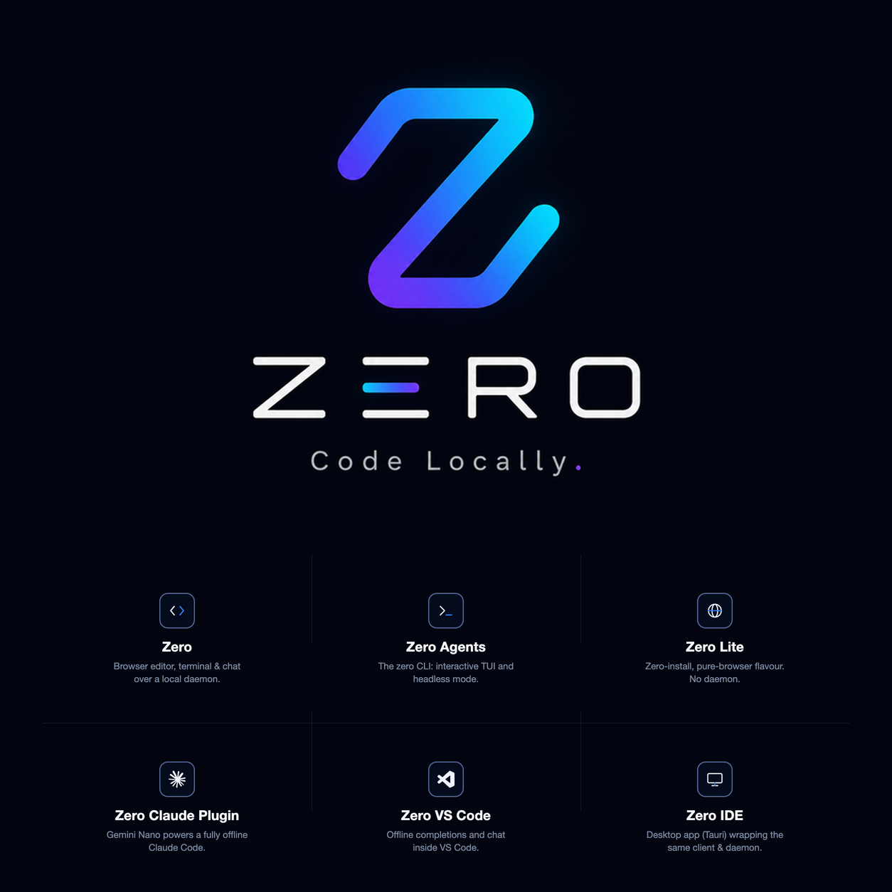

# Zero

[](https://dash.cloudflare.com/0d39754e3ae6404682a9bd4980eb399a/workers/services/view/zero-lite/production/builds)

<p align="center">
  
</p>

Zero is a local-first coding environment. Write code by hand with
copilot-style inline completions from an on-device model, plus an
integrated terminal and a chat panel for asking about the codebase - all
of it working fully offline, with no API key and no account.

## Which Zero do you want?

Zero is one engine with several products built on it. Pick the one that
fits how you work:

| Product | What it is | Best for |
|---|---|---|
| **Zero** | Browser editor + local daemon: completions, terminal, LSP, chat | Full offline coding environment |
| **Zero Agents** | `zero` CLI - interactive TUI or headless `-p` mode | Scripting, CI, terminal-first workflows |
| **Zero Lite** | Pure-browser, zero-install | Trying Zero with nothing to install |
| **Zero VS Code Plugin** | Inline completions + chat model inside VS Code | Staying in your existing editor |
| **Zero IDE** | Desktop app (macOS) wrapping Zero | A standalone app, no terminal setup |
| **Zero Claude Plugin** | Points Claude Code at an on-device model | Running Claude Code fully offline |

## Installation

Prebuilt artifacts are attached to each
[GitHub release](https://github.com/varunkumar/zero/releases).

### Zero IDE (macOS, Apple Silicon)

Download `Zero_<version>_aarch64.dmg` from the
[latest release](https://github.com/varunkumar/zero/releases/latest), open
it, and drag Zero into Applications. The build is ad-hoc signed (no Apple
Developer account behind it yet), so macOS Gatekeeper blocks the first
launch - right-click (or Control-click) `Zero.app` and choose **Open**
once to get past it.

### Zero VS Code Plugin

Download `zero-vscode-<version>.vsix` from the
[latest release](https://github.com/varunkumar/zero/releases/latest), then:

```
code --install-extension zero-vscode-<version>.vsix
```

This also requires the `zero` CLI on `PATH` (below) - the extension finds
or starts a daemon for whichever folder you open.

### Zero, Zero Agents (CLI/daemon)

```
curl -fsSL https://raw.githubusercontent.com/varunkumar/zero/main/scripts/get-zero.sh | sh
```

Downloads the right prebuilt tarball for your platform (macOS arm64, or
Linux x64/arm64) from the
[latest release](https://github.com/varunkumar/zero/releases/latest) and
installs a `zero` wrapper on `~/.local/bin/zero`. No Bun and no repo
checkout required.

**Building from source instead** (for contributors, or platforms without a
prebuilt tarball yet):

```
git clone https://github.com/varunkumar/zero.git
cd zero
./scripts/install.sh
```

This installs dependencies, builds the web UI, and puts a `zero` wrapper
script on `~/.local/bin/zero` that always runs against this checkout.
Requires [Bun](https://bun.sh) >= 1.1.

### Zero Lite

Nothing to install. Open
**[zero.varunkumar.dev](https://zero.varunkumar.dev)** in Chrome or Edge
and click **Open folder**.

### Zero Claude Plugin

Requires the `zero` CLI (above). See [usage](#zero-claude-plugin-1) below.

## Usage

### Zero / Zero Agents CLI

- `zero [path]` - interactive TUI, new session
- `zero --resume [path]` - interactive TUI, pick a session to resume
- `zero -p "task" [--yes] [--session <id>] [path]` - run one task
  headlessly (for scripts/CI)
- `zero serve [path] [--port <port>] [--gateway-port <port>]` - start the
  web daemon (editor/terminal/chat over HTTP/WS) and open
  `http://localhost:<port>` in a browser. Both ports default to a
  dynamically assigned free port; pass a specific port to pin it.
- `zero claude [path] [--gateway-port <port>]` - start the daemon, bridging
  Claude Code to Gemini Nano running in an attached browser tab
- `zero --version` - print the installed version

### Zero Lite

Open **[zero.varunkumar.dev](https://zero.varunkumar.dev)**, click **Open
folder**, and pick a project. Gemini Nano powers completions and chat.
There is no terminal and no language server - `zero serve` is unaffected
and does not offer Lite.

The badge at the top tracks the `Workers Builds: zero-lite` check on
`main`, the Cloudflare Pages build of `packages/web`. Green means the
latest `main` build passed and published `dist/`; red or pending is the
current build, not a static "deployed" label.

### Zero Claude Plugin

```
zero claude
```

prints a URL and an `ANTHROPIC_BASE_URL`/`ANTHROPIC_API_KEY` line. Open the
URL in Chrome or Edge with Gemini Nano available, then in another terminal:

```
ANTHROPIC_BASE_URL=http://127.0.0.1:<port> ANTHROPIC_API_KEY=<key> claude
```

Claude Code now runs fully offline against Nano. Only one browser tab
serves as the Nano host at a time - whichever is currently in the
foreground; closing or backgrounding it hands off to another open Zero tab
if one exists. Nano is a small model: expect a working offline agent, not
cloud-Claude parity on tool-choice accuracy.

### Zero VS Code Plugin

Open any folder in VS Code; the extension finds or starts a `zero serve`
daemon scoped to that folder and shows the active model in the status bar.
See [`packages/vscode/README.md`](packages/vscode/README.md) for details,
including how to enable Zero as a chat model provider.

## Architecture

Bun monorepo:

```
zero/
  packages/
    core/        # @zero/core     - isomorphic engine (no DOM, no Node APIs)
    protocol/    # @zero/protocol - shared JSON-RPC message and event types
    daemon/      # @zero/daemon   - Node/Bun capability server
    web/         # @zero/web      - browser client
    vscode/      # zero-vscode    - VS Code inline-completions extension
    desktop/     # zero-desktop   - Tauri desktop app (Zero IDE)
  docs/
```

`zero [path]` opens an interactive terminal UI rooted at a project directory.
`zero serve [path]` starts the daemon instead: it indexes the project and
serves the web client at `http://localhost:<port>`, with the browser
connecting back over one WebSocket carrying JSON-RPC both ways. Everything
works with the network unplugged.

- **Browser**: CodeMirror 6 editor, the completion engine and AgentRuntime
  (from `@zero/core`), chat panel, xterm.js terminal UI, settings, and the
  Chrome Nano provider.
- **Daemon**: file system, project watching, PTY sessions, LSP server
  management, **plugin host** (Graphify indexer, git status/blame, TODO/FIXME
  scanner - each independently toggleable and able to serve its own browser
  UI bundle), session store, and static serving of the client. See
  [`docs/plugins.md`](docs/plugins.md).

For the full system diagram, the milestone-by-milestone build history, and
every design doc, see [`docs/architecture.md`](docs/architecture.md).

## Contributing / building from source

```
bun install
bun test        # run all package tests
bun run typecheck
```

Requires Bun >= 1.1. All packages are TypeScript strict, ESM only. See
[`docs/architecture.md`](docs/architecture.md) for how the packages fit
together, and [`docs/releasing.md`](docs/releasing.md) for the release
process behind the artifacts above.
