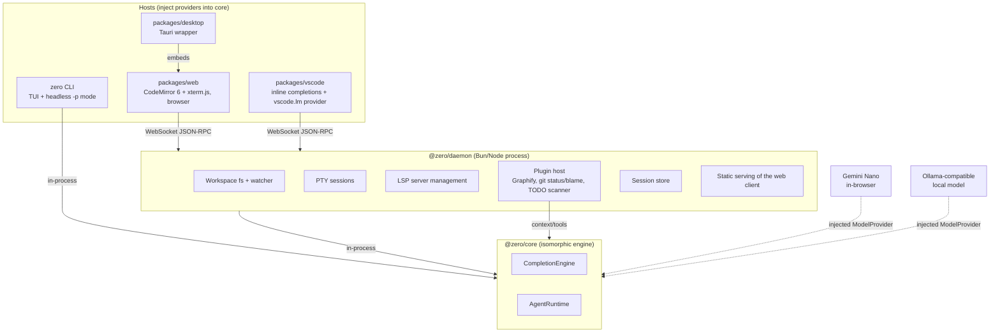

# Architecture and roadmap

This is the developer-facing deep dive: how the pieces fit together, and
the milestone history behind them. For what Zero is and how to install it,
see the [README](../README.md).

## System architecture

Zero is one engine (`@zero/core` + `@zero/protocol`) reused by five
products. The core engine never touches the DOM or Node/Bun APIs directly
- everything it needs (models, context, workspace, tools) is injected by
whichever host embeds it.

- **`@zero/protocol`** - shared JSON-RPC message/event types, Zod-validated
  at the boundary between any client and the daemon.
- **`@zero/core`** - the isomorphic engine: `CompletionEngine` and
  `AgentRuntime`, driven entirely through injected `ModelProvider`,
  `ContextProvider`, `WorkspaceProvider`, and `ToolProvider` interfaces. Runs
  identically inside the daemon (Zero, Zero Agents) and inside the browser
  with no daemon at all (Zero Lite).
- **`@zero/daemon`** - the Bun/Node process behind Zero and Zero Agents:
  workspace filesystem access, PTY sessions, LSP process management, the
  **plugin host** (see [`plugins.md`](plugins.md)), session persistence, and
  static serving of the built web client. Binds `127.0.0.1` only; WebSocket
  connections without the session token are rejected.
- **`@zero/web`** - the browser client: CodeMirror 6 editor, chat panel,
  xterm.js terminal, and the Chrome Gemini Nano model provider. Runs against
  a daemon (Zero) or standalone with no daemon at all (Zero Lite).
- **`zero-vscode`** - VS Code extension. Finds or spawns a `zero serve`
  daemon scoped to the open folder, then wires up inline completions and a
  `vscode.lm` chat model provider against it.
- **`zero-desktop`** - Tauri app that wraps the daemon (as a sidecar) and
  the web client into a native desktop shell (Zero IDE).

The editor stays fully usable when no model is available - a missing or
unreachable model degrades only the completion/chat subsystem, never
editing itself.

## Tech stack by package

| Package | Runtime/language | Key libraries | Role |
|---|---|---|---|
| `packages/core` (`@zero/core`) | TypeScript, isomorphic (no DOM/Node APIs) | none beyond the standard library - all capabilities are injected | `CompletionEngine`, `AgentRuntime`, provider interfaces |
| `packages/protocol` (`@zero/protocol`) | TypeScript | `zod` (schema validation at the RPC boundary) | Shared JSON-RPC message/event types |
| `packages/daemon` (`@zero/daemon`) | Bun/Node | `node-pty` (PTY), `web-tree-sitter` + `tree-sitter-javascript`/`tree-sitter-typescript` (Graphify parsing), `vscode-languageserver-protocol` + `vscode-jsonrpc` (LSP transport), `typescript-language-server`, `pyright` (bundled language servers), `ink` + `react` (terminal UI for the `zero` CLI itself), `ignore` (gitignore-aware file walking) | Workspace fs, PTY sessions, LSP process management, plugin host, session store, static serving |
| `packages/web` (`@zero/web`) | TypeScript, React 18, Vite | `codemirror` 6 (`@codemirror/*`) editor, `@xterm/xterm` + `@xterm/addon-fit` terminal rendering, `dockview-react` (panel layout), `cmdk` (command palette), `react-arborist` (file tree), `marked` + `dompurify` (chat markdown rendering), `tinykeys` (keybindings) | Browser client: editor, terminal UI, chat panel, workbench shell |
| `packages/vscode` (`zero-vscode`) | TypeScript | VS Code Extension API, `esbuild` (bundling), `@vscode/vsce` (packaging) | Inline completions + `vscode.lm` chat provider against a `zero serve` daemon |
| `packages/desktop` (`zero-desktop`) | Rust + Tauri 2, wrapping `packages/web` | `tauri`, `tauri-plugin-log`, `tauri-plugin-dialog`; daemon runs as a bundled sidecar process | Native macOS shell (Zero IDE) around the daemon + web client |

Everything above `@zero/core` and `@zero/protocol` is a **host**: it picks
a runtime (Bun/Node process, browser tab, VS Code extension host, Tauri
webview) and wires concrete providers into the engine. The engine itself
has zero opinions about any of those runtimes.

## Roadmap and milestone history

M0 through M8.6 - the full initial roadmap - are implemented on `main`:

- **M0** skeleton (daemon-served editor with save)
- **M1** offline copilot (Chrome Nano + Ollama-compatible fallback)
- **M1.5** editor shell (workbench, tabs, palette, search, themes)
- **M2** terminal (PTY) and LSP (diagnostics, hover, go-to-definition)
- **M3** Graphify and plugin host - tree-sitter code graph indexer feeding
  completion context
- **M4** chat / AgentRuntime - turn loop, session persistence, read-only
  tool calling, chat panel (completes v1 scope)
- **M5** Zero Agents - write tools, git checkpointing, headless CLI, model gateway
- **M6** Zero Lite - no-daemon browser flavour, live at [zero.varunkumar.dev](https://zero.varunkumar.dev)
- **M7** Zero Claude Plugin - offline Claude Code via Gemini Nano/Ollama
- **M7.5a** Zero VS Code Plugin - offline completions in VS Code
- **M7.6** Zero VS Code Plugin - registers Zero as a `vscode.lm` chat model provider
- **M8** Zero IDE (core wrap) - `packages/desktop` Tauri desktop app
- **M8.5** Zero IDE polish - native menus/dock integration, multi-window
  support, sidecar startup-hang timeout
- **M8.6** UI plugin framework - daemon-side plugins (git status/blame,
  TODO/FIXME scanner) contribute status bar items and sidebar panels the
  web workbench loads and mounts at runtime

Roadmap scope stops at M8.6: no cross-platform packaging or auto-update
yet, and native IDE integrations beyond VS Code are the likely next step.
See the [full design spec](superpowers/specs/2026-08-04-zero-design.md) for
the original complete roadmap.

### Design and plugin docs

- [Zero design](superpowers/specs/2026-08-04-zero-design.md)
- [M3 design](superpowers/specs/2026-08-05-m3-graphify-and-plugin-host-design.md)
- [M4 design](superpowers/specs/2026-08-06-m4-chat-agentruntime-design.md)
- [M5 design](superpowers/specs/2026-08-07-m5-zero-agents-design.md)
- [M7 design](superpowers/specs/2026-08-13-m7-zero-claude-plugin-design.md)
- [M7.5a design](superpowers/specs/2026-08-14-m7.5-vscode-completions-design.md)
- [M7.6 design](superpowers/specs/2026-08-14-m7.6-vscode-lm-provider-design.md)
- [M8 design](superpowers/specs/2026-08-17-m8-zero-ide-design.md)
- [M8.5 design](superpowers/specs/2026-08-18-m8.5-zero-ide-polish-design.md)
- [M8.6 design](superpowers/specs/2026-08-19-ui-plugin-framework-design.md)
- [Plugins](plugins.md)
- [Releasing](releasing.md)
